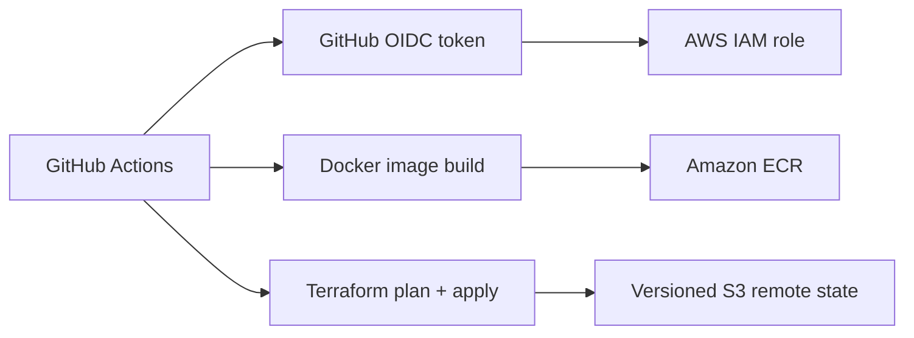

# Case Study — Terraform Delivery and OIDC-based AWS Deployment

## Purpose

This project connected application delivery with cloud infrastructure management. The goal was to build and validate a repeatable AWS workflow without storing long-lived AWS access keys in GitHub.

The work was completed in a real AWS learning account during its Free Tier period. After successful validation, the account was intentionally retired to avoid maintaining unused resources and credentials.

## Problem

A cloud deployment needs more than a Terraform folder or a Dockerfile. It needs a clear way to:

- authenticate CI/CD safely
- build and identify container images
- validate Infrastructure as Code before applying it
- keep Terraform state predictable
- separate reusable code from environment-specific values
- preserve evidence after temporary learning infrastructure is removed

## Validated AWS delivery architecture

## Implementation evidence

| Area | Evidence |
|---|---|
| CI/CD authentication | A successful GitHub Actions run assumed an AWS IAM role through OIDC instead of static credentials. |
| Container delivery | Docker images were published to Amazon ECR with environment and commit-SHA tags. |
| Terraform delivery | A successful workflow ran formatting, initialization, validation, planning and apply. |
| State management | The deployment used an S3 backend with native lockfile support. |
| Reusable infrastructure | The current code contains a secure S3 module with explicit inputs and outputs. |
| Current CI | Terraform configurations are validated and the container is built, started and health-checked without a live AWS account. |

Key evidence:

- [Historical AWS validation record](https://github.com/titoiunit/aws-terraform-infrastructure/blob/main/docs/historical-aws-validation.md)
- [Successful Terraform deployment](https://github.com/titoiunit/aws-terraform-infrastructure/actions/runs/23757359671)
- [Successful OIDC verification](https://github.com/titoiunit/aws-terraform-infrastructure/actions/runs/23742622936)
- [Successful ECR delivery](https://github.com/titoiunit/aws-terraform-infrastructure/actions/runs/23768419201)
- [Current portfolio CI](https://github.com/titoiunit/aws-terraform-infrastructure/blob/main/.github/workflows/terraform-pr-checks.yml)
- [Reusable secure S3 module](https://github.com/titoiunit/aws-terraform-infrastructure/tree/main/modules)

## Key decisions and trade-offs

### OIDC instead of long-lived access keys

GitHub Actions exchanged its identity token for short-lived AWS credentials through an IAM role. This reduced secret-management risk and tied access to the repository and workflow context.

### Commit-SHA image tags

Environment tags made deployments easy to identify, while commit-SHA tags provided immutable references for traceability and rollback.

### S3 remote state with lockfile support

Remote state made the infrastructure workflow repeatable beyond one local machine. Locking protected concurrent state changes. The current repository uses partial backend configuration so account-specific values remain outside source control.

### Retiring the learning account

The AWS account was not kept alive merely to make the portfolio appear continuously deployed. Successful run history and implementation evidence were retained, while active workflows were converted to reproducible provider-independent checks.

### Current CI instead of a broken deploy

The active workflow performs Terraform formatting and validation, builds the Docker image, starts the container and verifies its health endpoint. It requests no OIDC token and cannot change AWS resources.

## Validation approach

Historical AWS validation included:

- AWS identity confirmation through STS
- Terraform format, initialization, validation, plan and apply
- Docker image publication to ECR
- environment and commit-SHA image tags

Current validation includes:

- Terraform formatting
- canonical and development configuration validation without a backend
- Docker image construction
- container startup and live `/health` verification

## Operational and cost considerations

- Use least-privilege IAM scoped to the required repository, branch and workflow.
- Keep Terraform state and account-specific backend values outside Git.
- Destroy temporary learning resources after validation.
- Retire credentials and workflows when the associated account no longer exists.
- Preserve verifiable evidence without claiming that removed infrastructure is still live.

## Interview version

> I built and validated an AWS delivery workflow using Terraform, Docker, GitHub Actions, OIDC, ECR and remote state. After completing the Free Tier learning work, I intentionally retired the AWS account to avoid maintaining unused infrastructure. I preserved the successful deployment evidence and converted the repository to portable CI that validates Terraform and health-checks the container without requiring cloud credentials.

## Status

Completed historical AWS deployment with retained evidence, plus active provider-independent portfolio CI. No live AWS environment is claimed.
