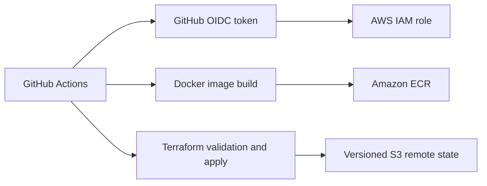

# Case Study — Terraform Delivery and OIDC-based AWS Deployment

## Purpose

This project connects application delivery with cloud infrastructure management. The goal was to practice a repeatable AWS workflow without storing long-lived AWS access keys in GitHub.

## Problem

A cloud deployment needs more than a Terraform folder or a Dockerfile. It needs a clear way to:

- authenticate CI/CD safely
- build and identify container images
- validate Infrastructure as Code before applying it
- keep Terraform state predictable
- separate development, QA and production concerns

## Architecture

## Implementation evidence

| Area | Implementation |
|---|---|
| CI/CD authentication | GitHub Actions requests an OIDC token and assumes an AWS IAM role instead of using static AWS credentials. |
| Container delivery | The build workflow creates Docker images and publishes both environment and commit-SHA tags to Amazon ECR. |
| IaC validation | The Terraform workflow runs formatting, initialization, validation and planning before applying. |
| State management | Terraform uses an S3 backend with native lockfile support. |
| Secure S3 baseline | The infrastructure defines bucket versioning, public-access blocking and Bucket Owner Enforced object ownership. |
| Environments | Workflows have explicit dev, QA and production choices, with environment-specific role and ECR repository values. |

Key implementation files:

- [Build and publish to ECR](https://github.com/titoiunit/aws-terraform-infrastructure/blob/main/.github/workflows/build-and-push-ecr.yml)
- [Terraform deployment workflow](https://github.com/titoiunit/aws-terraform-infrastructure/blob/main/.github/workflows/deploy-terraform.yml)
- [OIDC role test](https://github.com/titoiunit/aws-terraform-infrastructure/blob/main/.github/workflows/test-oidc.yml)
- [Terraform backend and provider versions](https://github.com/titoiunit/aws-terraform-infrastructure/blob/main/terraform/versions.tf)
- [Secure S3 configuration](https://github.com/titoiunit/aws-terraform-infrastructure/blob/main/terraform/main.tf)

## Key decisions and trade-offs

### OIDC instead of long-lived access keys

GitHub Actions is given `id-token: write` and exchanges that token for short-lived AWS credentials through an IAM role. This reduces secret-management risk and ties permissions to a named workflow and repository context.

### Commit-SHA image tags alongside environment tags

An environment tag makes a deployment easy to identify, while a commit-SHA tag provides an immutable reference for traceability and rollback.

### S3 remote state with lockfile support

Remote state makes the infrastructure workflow repeatable beyond one local machine. Locking prevents concurrent state changes from overwriting each other.

### Direct apply on the main branch

The current workflow is intentionally hands-on and deploys from `main`. Before using the same pattern for a production workload, I would add a pull-request plan check, protected environments, approval gates and a rollback runbook.

## Validation approach

The workflows contain explicit verification steps:

- confirm the AWS identity with `aws sts get-caller-identity`
- run `terraform fmt`, `init`, `validate` and `plan`
- build the Docker image before publishing it
- tag published images by environment and commit SHA

## Operational and cost considerations

- IAM roles should follow least privilege and be scoped to the required repository, branch and workflow.
- Terraform state must never be committed to Git.
- Temporary learning resources are destroyed after validation to avoid ongoing charges.
- Image repositories need a retention policy as image history grows.

## Interview version

> I built this to connect Terraform, Docker and GitHub Actions into one AWS delivery workflow. The key security decision was GitHub OIDC: GitHub assumes a short-lived AWS role instead of storing long-lived credentials. The pipeline validates Terraform, publishes traceable ECR image tags and keeps state remote, versioned and locked. My next production-hardening step would be PR plans and protected deployment environments.

## Status

Active hands-on implementation. The repository contains the infrastructure and workflows described above; production controls are documented as the next iteration rather than claimed as complete.
